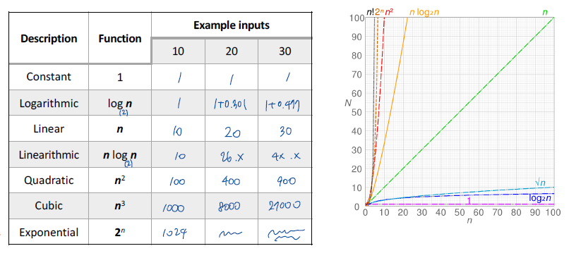
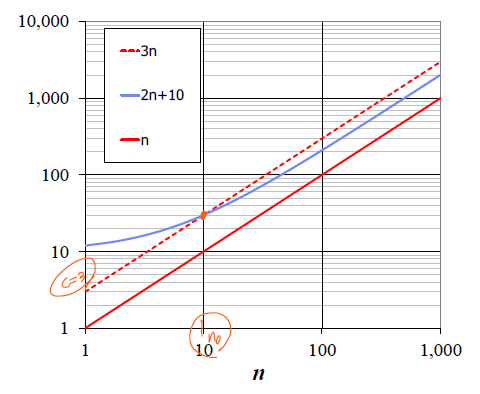

# 자료구조 퀴즈 - 성일

> 2021/10/09

[객체 지향 프로그래밍](#1-객체-지향-프로그래밍)

[시간 복잡도](#2-시간-복잡도)


## 1. 객체 지향 프로그래밍

> Object-Oriented Programming OOP

- 실 세계의 모든 것은 객체간의 상호작용에 의해 이루어진다는 개념 아래 모든 것을 객체로 정의
- 객체들이 서로 관계성을 가지고 시스템을 구성한다
- 개발자로 하여금 쉽게 커스터마이징이 가능하게 하고 유지보수성, 확장성, 재사용성을 증가시켜 생산성을 크게 늘려준 프로그래밍 기법이다.


### 특징

> Abstraction, Encapsulation, Inheritance, Polymorphism

##### Abstraction

- 시스템을 구축하기 위해 필요한 근본적인 요소들을 뽑아내는 과정
- 현실의 다양한 객체들의 공통된 특성을 모아 일반화한다
- 클래스를 정의하는데 중요한 역할을 한다

##### Encapsulation

- 각각 구현한 것들의 내부를 모두 보여주지 않음으로 시스템의 복잡도를 낮춘다(감춘다)
- 메서드를 하나로 묶어 변수와 메서드가 독립적으로 동작하지 않도록 한다
- 정보 은닉

##### Inheritance

- 객체를 정의할 때 기존에 존재하는 객체의 속성과 기능을 상속받아 정의하는 것
- 각 클래스의 공통 부분을 한번에 수정할 수 있게 하여 코드의 재사용성을 높여준다

##### Polymorphism

- 같은 타입 또는 같은 기능의 호출로 다양한 효과를 가져오는 것
- 하나의 인터페이스로 서로 다른 구현을 제공한다
- 메서드 오버로딩 (<u>Overloading</u>)
  - 한 클래스에 같은 이름의 메서드를 여러개 정의, 그 인자의 개수나 유형을 다르게 한다
- 메서드 오버라이딩(<u>Overriding</u>)
  - 상속 관계에 있는 하위 클래스가 상위 클래스의 메서드를 재정의한다


## 2. 시간 복잡도

> Time Complexity. Big-Oh Notation으로 표기

- 큰 데이터를 다루는 프로그램일수록 알고리즘의 시간 복잡도를 계산하고 고려하는 과정이 중요하다.

- 시간 복잡도를 측정하는 하드웨어가 다르거나 Input 데이터가 달라지면 러닝 타임도 그에 따라 다르게 측정된다. 따라서, 실험적으로 측정하는 방법에는 한계가 있으므로 <u>이론적인 방법</u>으로 시간 복잡도를 측정한다.


### Primitive Operations

- 알고리즘에 의해 수행되는 기본 연산 과정이다
- 하나의 연산 과정이 1 단위 시간을 소모한다고 가정한다
- 예를 들면, 표현식을 계산하거나, 변수에 값을 저장하거나, 배열에 접근하거나, 메서드를 호출하거나, 메서드로부터 반환값을 받는다거나 하는 과정을 말한다.


### Seven Important Functions



- 아래로 내려올 수록 n값의 증가에 따라 함수값이 더 빠르게 증가한다


### Big-Oh Notation

```
주어진 함수 f(n), g(n)에 대해,
f(n) <= c*g(n) for n >= n0 를 만족하는 양수 c, n0가 존재한다면
f(n)은 O(g(n)) 이라고 한다.
```



예를 들어, `2n+10`이 `O(n)`임을 증명한는 과정은 아래와 같다.

```
2n + 10 <= cn
(c-2)n >= 10
n >= 10/(c-2) 이므로 c=3, n0=10이 존재한다.
```

##### 규칙

- 낮은 차수의 항은 지운다. 상수항은 지운다.
- `O( )`안에는 가능한 가장 작은 표현을 적는다.
- `O( )`안에는 가능한 가장 간단한 표현을 적는다.


### Asypmtotic Algorithm Analysis

```
Asymptotic worst-case running time
= Number of primitive operations on worst-case input with size n
  when n tends to infinity
```

- n이 매우 크다고 가정하고 시간 복잡도를 계산한다

1. 알고리즘의 <u>worst case</u>에서의 primitive operation을 세고 input size `n`에 대해서 표현한다.
2. 알고리즘을 Big-Oh notation으로 표현한다. 

➡"알고리즘이 O(n) 시간으로 동작한다."
