# 2021.10.09 CS 질문

>Q1. 퀵 정렬이란? 병합 정렬과의 차이점은?
>
>Q2. 스택과 큐의 기본 개념. 두 자료구조의 차이점
>
>Q3. 회전이란
>
>Q4. 우선순위 큐란

<br>

## Q1. 퀵 정렬이란? 병합 정렬과의 차이점은?

```
A.
 퀵 정렬이란, 주어진 배열을 두 개로 분할하고 각각을 정렬하는 정렬 알고리즘이다.
 
 병합 정렬은 주어진 배열을 그냥 두 개로 나누눈 반면, 퀵 정렬은 기준 아이템(Pivot Item)을 기준으로, 이보다 작은 것은 왼편, 큰 것은 오른편에 위치시킨다.
 각 부분의 정렬이 끝난 후, 병합정렬은 '병합'이라는 후처리 작업이 필요하지만, 퀵 정렬은 필요로 하지 않는다.
 
 병합 정렬은 외부 정렬의 기본이 되는 정렬 알고리즘이다. 멀티코어 CPU나 다수의 프로세서에서 정렬 알고리즘을 '병렬화' 하기 위해서 병합 정렬 알고리즘이 활용된다.
  퀵 정렬은 입력 데이터가 매우 클 때 좋은 성능을 보이는 알고리즘이다.
  
  퀵 정렬의 평균 시간복잡도는 O(nlogn)이고, 최악의 경우 O(n^2)이다.
  병합 정렬의 평균 시간복잡도는 O(nlogn)이고 최악의 경우에도 O(nlogn)이다.
  일반적인 경우 퀵 정렬이 병합 정렬보다 빠르지만, 어떠한 상황에서도 병합 정렬은 O(nlogn)을 보장한다는 점에서 효율적인 알고리즘이다.
```

```python
# 퀵정렬 알고리즘
def quickSort(arr, l, r):
    if l < r:
        p = partition(arr, l, r)
        quickSort(arr, l, p-1)
        quickSort(arr, p+1, r)
        
def partition(arr, l, r):
    p = arr[l]
    i, j = l, r
    
    while i <= j:
        while i <= j and arr[i] <= p:
            i += 1
        while i <= j and arr[j] >= p:
            j += 1
        if i < j:
            arr[i], arr[j] = arr[j], arr[i]
    
    arr[l], arr[j] = arr[j], arr[l]
    
    return j
```

<br>

### Q2. 스택과 큐의 기본 개념. 두 자료구조의 차이점

```
A.
 스택이란, 데이터를 차곡차곡 쌓아올린 형태의 자료구조. 후입선출(Last-in First-out).
 삽입과 삭제가 한 방향에서만 이루어진다. 입구와 출구가 똑같음.
 활용 예시. 스마트폰. 사용자가 버튼을 클릭해서 새로운 화면이 열리면 push. 뒤로 가기를 눌러 현재 화면이 사라지고 이전 화면으로 돌아가는 것은 pop. 사용자가 현재 보고 있는 화면은 top.
 
 큐란, 선입선출(First-in First-out) 구조. 삽입은 enQueue, 삭제는 deQueue. 입구와 출구가 나누어져 있다. front(머리)가 출구이고 삭제 연산을 수행. rear(꼬리)는 입구이며 삽입 연산을 수행.
 활용 예시. 게임 대전 매칭 시스템. 플레이 버튼을 먼저 누른 유저가 매칭이 성사되면 먼저 게임을 플레이할 수 있음.
```

<스택>

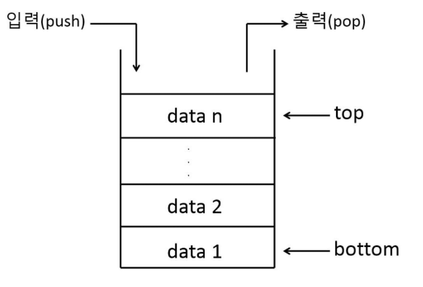

<큐>

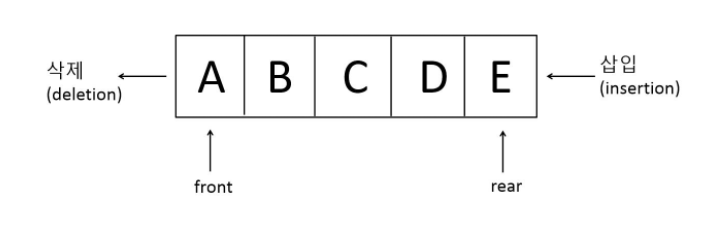

<br>

### Q3. 회전이란

```
A.
 AVL 트리는 이진검색트리(Binary Search Tree, BST)의 한 종류이면서 동시에 좌우 균형을 유지하는 구조. 모든 노드의 왼쪽과 오른쪽 서브트리의 높이 차이가 1이하.
 각 노드는 균형값(balance factor)을 가지고 있으며, 이 값은 오른쪽 서브트리에서 왼쪽 서브트리의 높이를 뺀 값. 이 값은 항상 (-1, 0, 1) 셋 중 하나의 값이어야 함. 균형값이 마이너스이면 left-heavy, 플러스 값을 가지면 right-heavy라고 함.
 pivot 노드는 새로운 노드가 추가되었을 때 균형값에 변동이 발생하여 unbalanced 된 노드들 중 신규노드와 가장 가까운 노드를 말한다.
 
 AVL 트리의 주요 연산은 search, insert, delete. 이 때 삽입이나 삭제를 하면 트리의 구조가 변경되는데 이때 AVL 트리의 속성을 유지하려면 트리를 수정해야 함.
 트리를 수정하는 방법 - 단순 회전(Single Rotation), 이중 회전(Double Rotation)
 
 1) 단순 회전
 - left, left일 경우. 균형값이 left-heavy => Single Right Rotation
 - right, right일 경우. 균형값이 right-heavy => Single Left Rotation
 
 2) 이중 회전
 - left, right일 경우. 균형값이 각각 right-heavy, left-heavy => Double Left-Right Rotation 
 - right, left일 경우. 균현값이 각각 left-heavy, right-heavy => Double Right-Left Rotation
```

<AVL 트리의 모습>

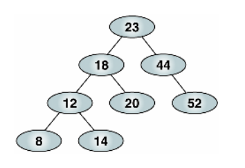

<br>

<회전 GIF>


<br>

<왼-왼 단순 회전>

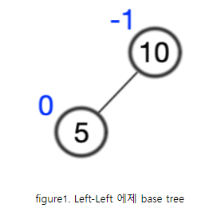


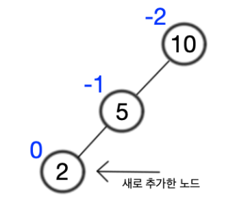

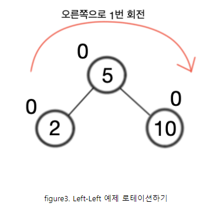

<br>

<왼-오 이중 회전>

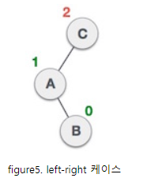

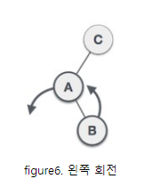

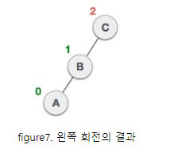

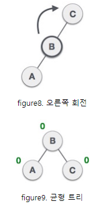

<br>

### Q4. 우선순위 큐란

```
A.
 큐(Queue)는 일반적으로 FIFO의 구조이다. 먼저 들어온 데이터가 먼저 나가는 것.
 하지만 우선순위 큐(Priority Queue)는 들어간 순서에 상관없이 우선순위가 높은 데이터가 먼저나오는 것을 말한다. 우선순위 큐는 힙(Heap)으로 구현할 수 있음.
 배열이나 연결 리스트로 우선순위 큐 구현시, 삭제할 때에는 시간복잡도가 O(1)이지만, 삽입 연산일 때에는 O(n)이 된다. 데이터 삽입/삭제 과정에서 데이터를 한 칸씩 당기거나 미는 연산을 계속 해야 함. 또, 삽입의 위치를 찾기 위해서 배열에 저장된 모든 데이터와 우선순위를 비교해야 함.
 반면, 힙으로 구현하면 삭제와 삽입 모두 O(log2n). 힙은 우선순위를 비교하기만 하면 됨.
 
 힙(Heap)은 완전 이진 트리(Complete Binary Tree)이다. 모든 노드에 저장된 값들은 자식 노드의 값보다 크거나 같으면 최대힙, 작거나 같으면 최소힙이라 부른다.
 최대힙이던 최소힙이던 루트 노드에는 우선순위가 가장 높은 것이 자리잡는다.
 
 ※ 힙은 배열을 통한 구현이 좋다. 힙은 이진 트리인데 이진 트리를 구현하는 도구는 배열이 될 수도 있고, 연결리스트가 될 수도있다. 위에서 우선순위 큐는 배열이나 연결리스트가 아닌 힙으로 구현해야 한다고 했는데, 왜 힙을 배열로 구현해야 하는지 헷갈리면 X. 힙을 배열로 구현함으로써, 우선순위 큐의 상황을 코드로 구현하는 것.
 
 우선순위 큐 활용 예시. 네트워크 트래픽 제어, OS 작업 스케쥴링
```

<힙의 삭제 연산>

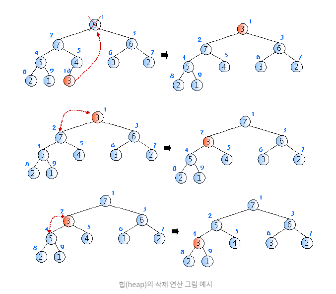