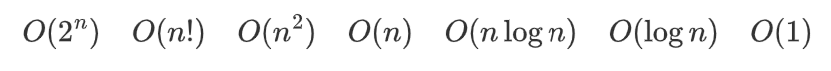
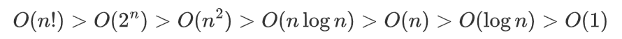

# 2021.10.09 CS 자료구조

>Q1. 시간 복잡도 비교
>
>Q2. 동적 계획법의 정의, 핵심이 되는 기술
>
>Q3. 그래프 탐색 알고리즘 2개 비교
>
>Q4. 힙 - 사용 자료구조와 종류

 

### Q1. 시간 복잡도 비교

### A1.

 

### Q2. 동적 계획법의 정의, 핵심이 되는 기술

### A2.

##### Dynamic Programming 

* 문제를 여러 개의 하위 문제로 나누어 푼 다음, 그 해를 이용하여 보다 큰 크기의 문제를 해결하여, 최종적인 문제를 해결하는 알고리즘
* 각 하위 문제의 해결을 계산한 뒤, 해결책을 저장(memoization) 하여 후에 같은 하위 문제가 나왔을 경우 해결 -> 계산 횟수 줄임

##### Memoization

* 이전에 계산한 값을 메모리에 저장해서 다시 계산하지 않도록 하여 전체적인 실행 속도를 빠르게 하는 기술
* 재귀를 이용해 fib()를 구현하면 O(2^n) 이지만, DP를 이용하면 O(n)

 

### Q3. 그래프 탐색 알고리즘 2개 비교

### A3.

##### DFS (Depth First Search)

* 현재 정점에서 갈 수 있는 정점까지 들어가면서 탐색
* stack 또는 재귀함수로 구현

##### BFS (Breath First Search)

* 현재 정점에 연결된 가까운 정점들부터 탐색
* queue로 구현

 

### Q4. 힙 - 사용 자료구조와 종류

### A4.

##### Heap

* **완전 이진 트리**에 있는 노드 중에서 키 값이 가장 큰 노드나 가장 작은 노드를 찾기 위해 만든 자료 구조
* **최대 힙** : 키 값이 가장 큰 노드를 찾기 위한 완전 이진 트리
  * 부모 노드의 키 값 > 자식 노드의 키 값
* **최소 힙** : 키 값이 가장 작은 노드를 찾기 위한 완전 이진 트리
  * 부모 노드의 키 값 < 자식 노드의 키 값

