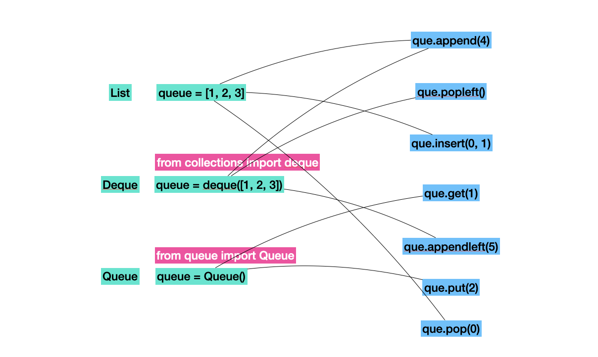

# 자료구조 문제

## 1. Queue란 무엇인가요?

정의와 특징, 사용가능한 연산(메서드) 삽입 / 접근 / 삭제 를 말해주세요.


## 2.  파이썬의 Queue 자료구조를 사용하는 방법과 메서드를 알맞게 연결해보세요.

- 자료구조 사용법과 메서드 


## 3. Stack 이란 무엇인가요?

정의와 특징, 사용가능한 연산(메서드) 를 말해주세요.


## 4. list 메서드를 활용하여 각 문제에 답해 보세요.

```python
cards = [10, 5, 15, 11, 9]
# >>> 가장 작은 숫자의 인덱스를 구하세요.
```

```python
card_text = "hello, world!"
# >>> e 의 인덱스를 구하세요.
```

```python
txt = "hello world"
a = txt.find("e")
b = txt.find("l", 5, 10)
c = txt.find("q")
# >>> 각 결과를 구하세요.
1
9
-1
```


---

# 답안

## 1. Queue란 무엇인가요?

큐(Queue) 란 데이터의 순서 관계를 유지하는 추상 자료형이다.

데이터를 저장하는 순서대로 기억하고, 가장 먼저 저장된 데이터부터 삭제할 수 있다.

FIFO 퍼스트 인, 퍼스트 아웃. 

데이터는 앞에서만 삭제하고, 뒤에서만 삽입한다.

양면 큐 자료형과는 다른다. 양면 큐 자료형 deque는 양쪽으로 들어가고 양쪽으로 나갈 수 있지만, 일반 큐는 한 쪽으로 들어가고 한 쪽으로만 나갈 수 있다.

- 맨 **뒤** 데이터 추가 : queue.append(x)
- 맨 앞 데이터 삭제 : queue.popleft()  - deque / queue.pop() - lists
- 맨 앞 데이터 접근 : queue[0]


## 2. 파이썬의 Queue 자료구조를 사용하는 방법과 메서드를 알맞게 연결해보세요.

https://www.daleseo.com/python-priority-queue/

https://ninefloor-design.tistory.com/154 (정리표참고)




## 3. Stack 이란 무엇인가요?

스택은 데이터 간의 순서 관계를 유지하는 추상 자료형으로,

가장 뒤에 데이터를 추가하고, 또 가장 마지막 데이터를 삭제할 수 있다.

특징으로는 LIFO 라 하여 라스트 인 퍼스트 아웃- 가장 마지막에 들어온 데이터가 가장 먼저 삭제된다.

파이썬의 deque와 list 둘 다 스택처럼 이용할 수 있으며 시간 복잡도는 같다.

- 맨 뒤 데이터 추가 : stack.append()
- 맨 뒤 데이터 삭제 : stack.pop()
- 맨 뒤 데이터 접근 : stack[-1]


## 4. list 메서드를 활용하여 각 문제에 답해 보세요.

```python
1
9
-1
```

```python
cards = [10, 5, 15, 11, 9]
# >>> 최소값 인덱스를 구하세요.
print(cards.index(min(cards)))
```

```python
card_text = "hello, world!"
# >>> e 의 인덱스를 구하세요.
print(card_text.find("e"))
```

