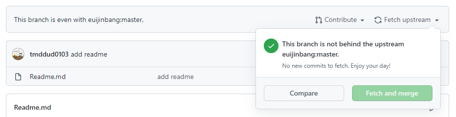

# Readme

Computer Science Study

### 폴더

- 날짜 + 제목 + 이름으로 통일해주세요!
- 그래야 자료를 찾아보기 쉬울 것 같습니다!

### 자신이 올린 내용을 개인 Repositories에 올리는 방법

1. fork를 뜬다
2. 원본에 pull push 원본 : (https://github.com/euijinbang/cs_study)
3. 개인 Repositories에 들어간다
4. 아래에 보이는 Fetch upstream을 클릭
5. 업데이트 완료 타란!

---

