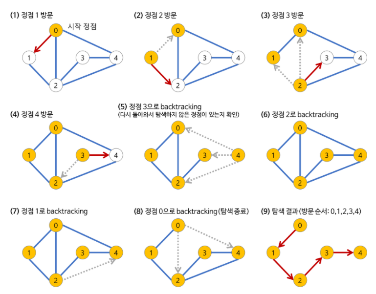
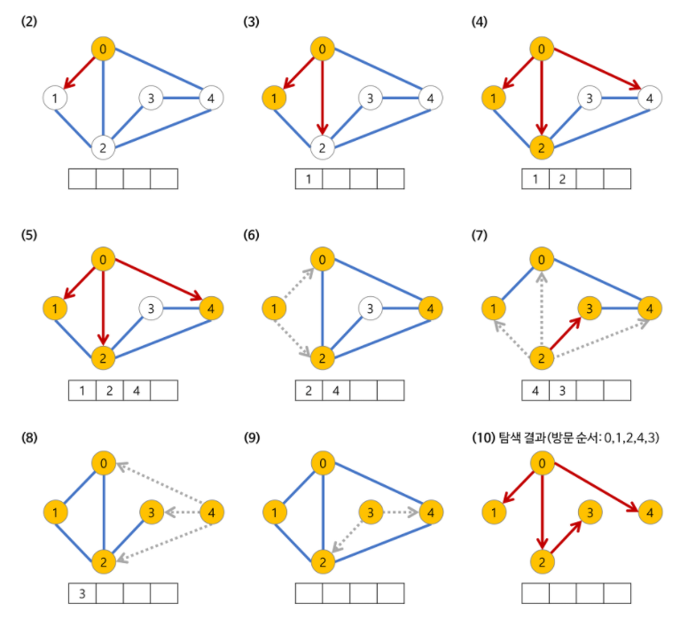
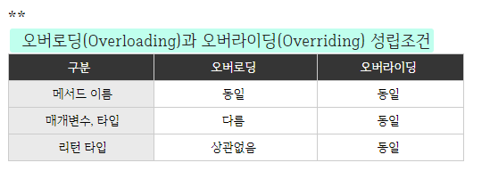
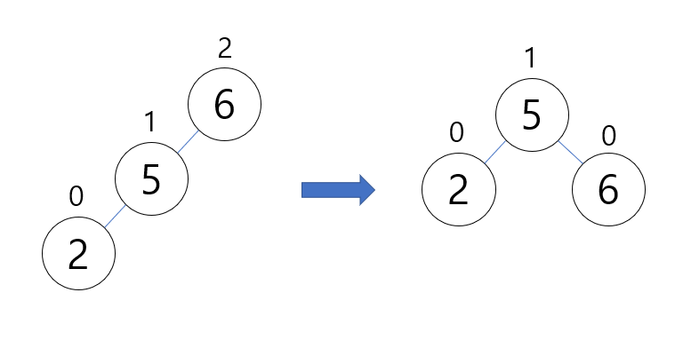
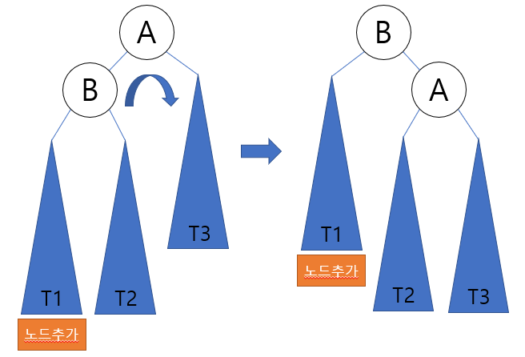

# 자료구조


## heap 란?

## BFS, DFS란?


**깊이 우선 탐색(DFS) 과 너비 우선 탐색(BFS)**

**※ 깊이 우선 탐색 (DFS, Depth-First Search)의 개념**

\- 루트 노드(혹은 다른 임의의 노드)에서 시작해서 다음 분기(branch)로 넘어가기 전에 해당 분기를 완벽하게 탐색하는 방법

미로를 탐색할 때 한 방향으로 갈 수 있을 때까지 계속 가다가 더 이상 갈 수 없게 되면 다시 가장 가까운 갈림길로 돌아와서 이곳으로부터 다른 방향으로 다시 탐색을 진행하는 방법과 유사함

즉 넓게(wide) 탐색하기 전에 깊게(deep) 탐색함 

모든 노드를 방문하고자 하는 경우에 이 방법을 선택함

깊이 우선 탐색(DFS)이 너비 우선 탐색(BFS)보다 좀 더 간단함

검색 속도 자체는 너비 우선 탐색(BFS)에 비해서 느림

**※ 깊이 우선 탐색(DFS)의 특징**

\- 자기 자신을 호출하는 순환 알고리즘의 형태를 지님

\- 이 알고리즘을 구현할 때 가장 큰 차이점은 그래프 탐색의 경우 어떤 노드를 방문했었는지 여부를 반드시 검사해야한다는 것 (이를 검사하지 않을 경우 무한루프에 빠질 위험이 있음)



**※** **깊이 우선 탐색(DFS)의 시간 복잡도**

\- DFS는 그래프(정점의 수 : N, 간선의 수: E)의 모든 간선을 조회함

\* 인접 리스트로 표현된 그래프 : O(N+E)

\* 인접 행렬로 표현된 그래프 : O(N^2)


**※ 너비 우선 탐색 (BFS, Breadth-First Search)**

\- 루트 노드(혹은 다른 임의의 노드)에서 시작해서 인접한 노드를 먼저 탐색하는 방법

시작 정점으로부터 가까운 정점을 먼저 방문하고 멀리 떨어져 있는 정점을 나중에 방문하는 순회 방법

즉 깊게(deep) 탐색하기 전에 넓게(wide) 탐색하는 것

두 노드 사이의 최단 경로 혹은 임의의 경로를 찾고 싶을 때 이 방법을 선택함

ex) 지구 상에 존재하는 모든 친구 관계를 그래프로 표현한 후 Ash 와 Vanessa 사이에 존재하는 경로를 찾는 경우

\* 깊이 우선 탐색의 경우 - 모든 친구 관계를 다 살펴봐야할지도 모름

\* 너비 우선 탐색의 경우 - Ash와 가까운 관계부터 탐색

**※ 너비 우선 탐색(BFS)의 특징**

\- BFS 는 재귀적으로 동작하지 않는다.

\- 이 알고리즘을 구현할 때 가장 큰 차이점은 그래프 탐색의 경우 어떤 노드를 방문했었는지 여부를 반드시 검사해야한다는 것이다 이를 검사하지 않을 경우 무한 루프에 빠질 위험이 있다.

\- BFS 는 방문한 노드들을 차례로 저장한 후 꺼낼 수 있는 자료 구조인 큐(Queue)를 사용함 

\- 즉 선입선출(FIFO) 원칙으로 탐색




## Queue란? Stack이란?

스택(stack)이란 **쌓아 올린다는 것**을 의미한다. 

스택은 위의 사진처럼 **같은 구조와 크기의 자료**를 **정해진 방향으로만** 쌓을수 있고,

**top으로 정한 곳을 통해서만 접근**할 수 있다.

top에는 가장 위에 있는 자료는 가장 최근에 들어온 자료를 가리키고 있으며,

삽입되는 새 자료는 top이 가리키는 자료의 위에 쌓이게 된다.

스택에서 자료를 삭제할 때도 top을 통해서만 가능하다.

스택에서 top을 통해 **삽입하는 연산**을 'push' , top을 통한 **삭제하는 연산**을 'pop'이라고 한다.

스택의 구조를 **후입선출(LIFO, Last-In-First-Out) 구조**


Queue 의 사전적 의미는 1. (무엇을 기다리는 사람, 자동차 등의) **줄** , 혹은 **줄을 서서 기다리는 것**을 의미한다.

따라서 일상생활에서 놀이동산에서 줄을 서서 기다리는 것, 은행에서 먼저 온 사람의 업무를 창구에서 처리하는 것과 같이

**선입선출(FIFO, First in first out) 방식**의 자료구조를 말한다. 


## 다이나믹 프로그래밍이란?

 == 동적 프로그래밍

하나의 문제는 단 한번만 풀도록 하는 알고리즘

ex) 피보나치 수열을 메모이제이션을 통해 구현


## 오버로딩과 오버라이딩의 차이점은?

**오버로딩(Overloading)** : 같은 이름의 메서드 여러개를 가지면서 매개변수의 유형과 개수가 다르도록 하는 기술

**오버라이딩(Overriding)** : 상위 클래스가 가지고 있는 메서드를 하위 클래스가 재정의해서 사용




- 상속이란?

**inheritance**

\1. 상속받은 재산, 유산; 상속  2. (과거·선대로부터 물려받는) 유산, 유전(되는 것)

```
class 자식클래스 extends 부모클래스
```


## 객체지향 프로그래밍이란? 객체지향 프로그래밍의 3대 특징은?

**객체 지향 프로그래밍**은 컴퓨터 **프로그래밍** 패러다임중 하나로, **프로그래밍**에서 필요한 데이터를 추상화시켜 상태와 행위를 가진 **객체**를 만들고 그 **객체**들 간의 유기적인 상호작용을 통해 로직을 구성하는 **프로그래밍** 방법

**캡슐화(Encapsulation)**

캡슐화는 데이터(속성)와 데이터를 처리하는 함수를 하나로 묶은 것을 의미

**정보은닉(Information Hiding)**

캡슐화에서 가장 중요한 개념으로, 다른 객체에게 자신의 정보를 숨기고 자신의 연산만을 통하여 접근을 허용하는 것

**추상화(Abstraction)**

추상화는 풀필요한 부분을 생략하고 객체의 속성 중 가장 중요한 것에만 중점을 두어 개략화하는것, 즉 모델화를 하는 것

**상속성(Inheritance)**

상속성은 이미 정의된 상위 클래스(부모 클래스)의 모든 속성과 연산을 하위 클래스가 물려받는것을 의미

**다형성(Polymorphism)**

다형성은 메시지에 의해 객체(클래스)가 연산을 수행하게 될 때 하나의 메시지에 대해 각 객체(클래스)가 가지고 있는 고유한 방법9특성)으로 응답할 수 있는 능력을 의미


## 인터페이스와 추상클래스 각각의 특징과 차이점은?(자바의 내용, 추후 첨가)

##### 추상클래스란?

추상 메서드를 선언하여 **상속을 통해서 자손 클래스에서 완성하도록 유도**하는 클래스 

미완성 설계도라고도 표현

##### 인터페이스란?

추상클래스가 미완성 설계도라면 인터페이스는 **기본 설계도**

인터페이스도 추상클래스처럼 다른 클래스를 작성하는데 도움을 주는 목적으로 작성하고 클래스와 다르게 **다중상속(구현)**이 가능


## Call by value, call by reference는 각각 무엇인가?

함수의 호출 방식

공통점

함수가 호출될 때, 메모리 공간 안에서는 `함수를 위한 별도의 임시 공간`이 생성된다. 함수가 종료되면 해당 공간은 사라진다.

#### 값에 의한 호출Call by value

복사된 인자는 함수 안에서 지역적으로 사용되는 local value의 특성을 가진다

=> 인자의 값이 변경되어도, 외부의 변수의 값은 변경되지 않는다.

- 원시 자료형 (primitive type) : call-by-value 로 동작 (int, short, long, float, double, char, boolean )
- 참조 자료형 (reference type): call-by-reference 로 동작 (Array, Class Instance)

#### 참조에 의한 호출call by reference

함수 안에서 인자의 값이 변경되면, 아규먼트로 전달된 객체의 값도 함께 변경


## static의 의미는?

**정적 메소드**는 클래스를 통해 직접 접근할 수 있는 메소드를 의미(파이썬)

#### 정적(Static)이란?(자바)

정적(static)은 고정된이란 의미를 가지고 있습니다. Static이라는 키워드를 사용하여 Static변수와 Static메소드를 만들 수 있는데 다른말로 정적필드와 정적 메소드라고도 하며 이 둘을 합쳐 정적 멤버라고 합니다. 


## garbage collection이란?

### 메모리 관리 기법 중 하나

프로그램이 동적으로 할당했던 메모리 영역 중에서 필요없게 된 영역을 해제하는 기능

동적 할당된 메모리 영역 가운데 어떤 변수도 가리키지 않는 메모리 영역을 탐지하여 자동으로 해제하는 기법


## 그래프를 정의한다면?

그래프 == 자료구조

그래프는 vertex와 edge로 구성된 한정된 비선형 자료구조를 의미


## 해싱이란?

해시함수(hash function)란 데이터의 효율적 관리를 목적으로 임의의 길이의 데이터를 고정된 길이의 데이터로 매핑하는 함수

키(key)란 매핑전 원래 데이터의 값

해시값(hash value)란 매핑후 데이터의 값

매핑하는 과정 자체를 해싱(hashing)이라고 한다.


## priority queue란?

우선순위 큐

큐와 동일하게 움직임 but, 가장 앞의 값은 최소값을 가지고, 그 뒤는 트리의 구조를 가진다

=> 대부분 오름차순이나 트리의 특성상 부분적으로 값이 달라지는 경우 존재

키(KEY) ——> 해시 함수(hash function) ————> 해시값(hash value)

[이름]          [해싱 과정]         [index(hash value)  : data ]


[10, 15, 30, 40, 50, 100, 40]


## 정렬 알고리즘에는 무엇이 있는가? 그 중 하나의 장단점은?

버블,  선택, 퀵, 힙, 삽입, 병합 등 


## AVL트리와 회전

**AVL 트리**

AVL 트리는 **전체 트리의 구조가 균형이 맞도록 하는 트리**이다. 즉, 트리 구조가 한쪽으로 쏠리는 것을 막자는 것이 가장 기본적인 개념이다. 

 

AVL 트리는 다음과 같은 특징이 있다.

1. 균형도(Balance Factor)라는 개념이 있다.
2. 리프 노드의 균형도는 0이다.
3. 균형도는 '왼쪽 자식 트리의 높이 - 오른쪽 자식 트리의 높이'로 계산한다.
4. 왼쪽 자식 노드와 오른쪽 자식 노드의 균형도는 -1, 0, 1의 세 가지 값만 갖는다.


#### **AVL 트리의 구성 및 구현**

앞에서 AVL 트리가 무엇이고 어떤 특징을 가지는지 대략적으로 살펴보았다. 이제는 구체적으로 어떤 상황에서 어떻게 균형을 맞추게 되는지 알아보고 구현까지 해보겠다.

우선 회전하게 되는 경우에 대해서 먼저 정의를 해보자. 총 4가지 타입으로 나눌 수 있다. 새로 삽임된 노드 N으로부터 가장 가까우면서 균형 인수가 +-2가 된 조상 노드를 A라고 하자. 

- **LL 타입** : N이 A의 왼쪽 서브 트리의 왼쪽 서브 트리에 삽입된다. (Left Left)
- **LR 타입** : N이 A의 왼쪽 서브 트리의 오른쪽 서브 트리에 삽입된다. (Left Right)
- **RR 타입** : N이 A의 오른쪽 서브 트리의 오른쪽 서브 트리에 삽입된다. (Right Right)
- **RL 타입** : N이 A의 오른쪽 서브 트리의 왼쪽 서브 트리에 삽입된다. (Right Left)


- **LL 회전** : A부터 N까지의 경로상의 노드들을 오른쪽으로 회전시킨다.
- **LR 회전** : A부터 N까지의 경로상의 노드들을 왼쪽-오른쪽으로 회전시킨다.
- **RR 회전** : A부터 N까지의 경로상의 노드들을 왼쪽으로 회전시킨다.
- **RL 회전** : A부터 N까지의 경로상의 노드들을 오른쪽-왼쪽으로 회전시킨다.

한번만 회전시키는 것을 **단순 회전(Single rotation)**이라고 하는데 LL 회전, RR 회전이 여기에 속한다. 이 경우, 탐색 순서를 유지하면서 부모와 자식의 위치를 교환하면 된다. 두 번의 회전이 필요한 것은 **이중 회전(Double rotation)**이라고 하며 LR회전, RL 회전이 여기에 속한다.

**LL 회전**



위 그림의 왼쪽 트리는 LL 타입의 경우로, 노드 6은 균형 인수가 2로서 불균형하다. 오른쪽으로 "회전"을 시키면(6과 5를 바꾸면) 다시 균형 트리를 만들 수 있다. "회전"은 루트와 자식 노드를 바꾸는 것을 의미한다.

보다 일반적인 경우를 생각해 보자. 일반적인 LL 타입은 조상 노드의 A의 왼쪽 서브 트리의 왼쪽 서브 트리에 노드가 추가됨으로 해서 발생한다. 다음 그림처럼 LL 회전은 노드들을 오른쪽으로 회전시키면 된다.





